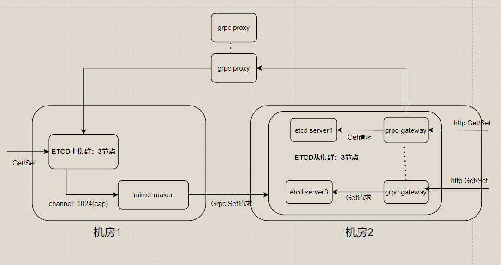

# 实习21

## 双活

基本思路: 两套etcd集群，使用watch机制监听主集群整个键值空间。将收到的数据更新事件从主集群发送到从集群。利用proxy负载均衡客户端读请求。其余请求发送给主机房。

### 架构设计

### 热备参数配置

+ 热备的队列大小可调 - 默认1024

### mirror maker设计

mirror maker的数据热备份分两个阶段。

1. sync同步阶段: 基于确定revision的整个键空间，通过Get()获取数据，同时转发从集群
2. updates阶段: 基于watch()机制，将put和delete两类消息转发从集群

### 故障恢复

单集群情况的基本恢复操作见etcd文档。

#### 主备切换

采用被动切换，主要有主集群不可用、从集群不可用、主从集群均不可用三种场景。考虑如下假设，两个集群分别包含3个节点。

##### 主集群不可用，从集群正常

+ 主集群大于等于两个节点故障。写操作暂时无法进行。
+ 一：切换到从集群
+ 二：尝试排查主集群问题，见etcd运维文档。

##### 从集群不可用，主集群正常

从集群大于等于两个节点故障。分发给从集群的操作无法进行。

+ 一、尝试排查从集群问题，见etcd运维文档。
+ 二、mirror maker配置完成即可。

##### 主从集群均不可用

+ 见etcd运维文档
+ 优先从主集群恢复数据

### 设计tradeoff

+ 从集群读取数据不一定成功，即主从集群仅满足最终一致性

## TODO

1. etcd是如何实现watch机制的
2. etcd的mvcc是如何实现
    + revision和txn的对应关系

## rationale

+ 可用性 > 一致性
+ 同城机房延迟小
+ 不要求支持跨机房的分布式事务操作
+ 对二方库的改动尽量小

## 实现

+ 修改
