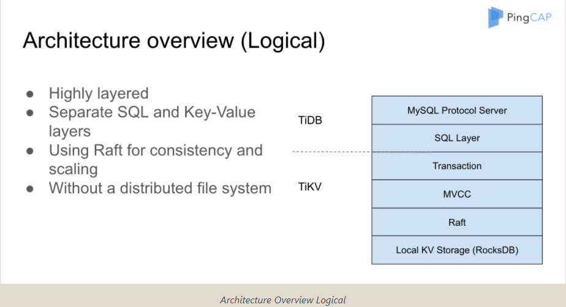
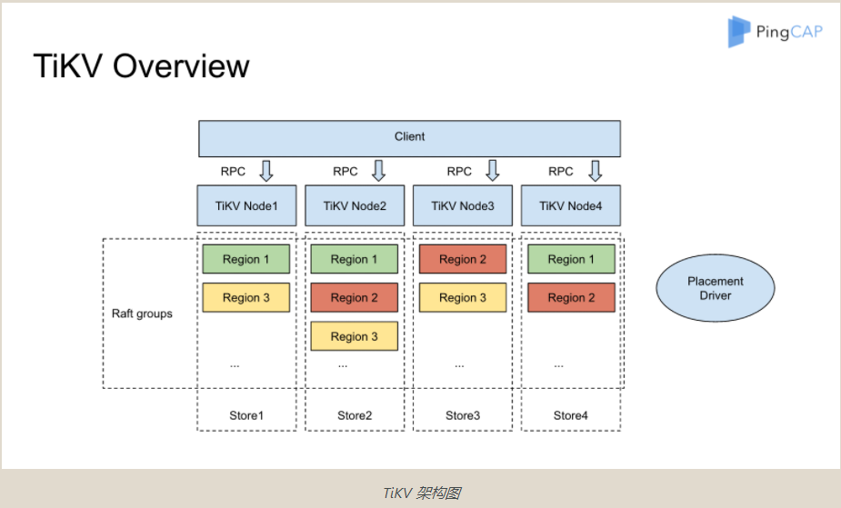

# 实习7

## 上午

+ etcd的ppt整理
+ 尝试用beamer制作ppt

## TiDB lec1

### 1. readings

#### 1.1 [How do we build TiDB](https://pingcap.com/blog-cn/how-do-we-build-tidb/)

##### motivation: 传统分布式数据库的天花板

+ 表达式和计算过程理应推到各个存储节点，而非获取数据后在中心节点处理
+ mysql实现分布式的限制
  + 方案一：通过MySQL的server把InnoDB变成分布式数据库，各个存储节点获取数据后在中心节点处理
    + 问题1：MySQL生成的执行计划是单机的，默认整个计划的cost也是单机的，例如：相邻行之间读取开销很小。分布式系统下存在问题。
    + 问题2：从各个节点取回数据在server处理的开销太大，必须要用分布式的plan，同时理解系统的状态以实现最高的执行效率。
  + 方案二：利用Proxy，如何决策？
    + 问题1：不支持分布式事务
    + 问题2：不支持跨节点join
    + 问题3：无法理解复杂的plan
+ mysql的其它问题
  + 支持的复制方式是半同步或异步，半同步可能降级成异步
  + 数据中心切换时，由数据一致性问题

##### TiDB对应F1，TiKV对应Spanner的架构图

软件栈整体架构

tikv架构

+ 不同raft group之间通讯：MySQL的group commit机制
  + 发送的消息share同一个connection，pipeline + batch发送
+ 数据region自动切片（默认64MB）
+ 扩容：同一region的不同备份是跨数据中心的复制。
+ tikv -> rust
+ tidb -> go

##### MVCC

+ 优势：支持lock-free的snapshot read
+ 需要支持数据的GC
+ 对于每一个键值对，存储两块数据：meta和data
  + meta描述数据当前版本数

##### 分布式事务模型？

+ 基于google的percolator
+ 两阶段提交
+ 乐观锁？
  + 事务在本地修改后，不加锁
+ 幻读？：允许读到最新版本也允许读到旧版本。
+ *路由：*如何做sql到kv节点的映射

##### placement driver

+ 系统状态监控
+ 维持足够的副本数
+ 性能负载
+ *Raft:* leader transfer, 降低原leader的负载，怎么做的？
  + 动态调整系统负载的同时，不用迁移数据=>不会形成抖动。

##### mysql sharding

+ 单机到多机需要sharding key
  + 必须直到row存储的最终位置
+ *DDL?*
  + *Online, Asynchronous Schema Change in F1*

##### 阅读中不太懂的问题

1. mysql底层机制(ex. group commit)
2. raft group之间通信
3. 事务的隔离机制
4. 乐观锁，percolator论文
5. PD和k8s，调度策略等等
6. mysql基于proxy的sharding的具体方案
7. 分布式数据库schema改变
