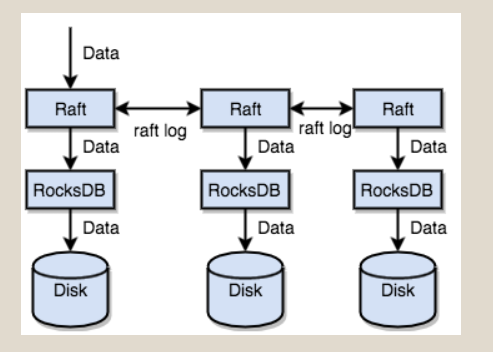

# 实习8

## *三篇文章了解TiDB技术内幕 - 说存储*

### 存储架构



#### region

+ 连续的key保存在一个存储节点上，每一段称为一个region，默认96mb。
+ 以region为单位做数据的分散和复制：每个region对应一个raft group
+ 组件1：保证region均匀地散步在集群每个节点上
+ 组件2：记录region在节点上面的分布

#### MVCC

```
Key1-Version3 -> Value
Key1-Version2 -> Value
Key1-Version1 -> Value
……
Key2-Version4 -> Value
Key2-Version3 -> Value
Key2-Version2 -> Value
Key2-Version1 -> Value
……
KeyN-Version2 -> Value
KeyN-Version1 -> Value
……
```

#### 事务

[percolator](https://www.usenix.org/legacy/event/osdi10/tech/full_papers/Peng.pdf)

乐观锁：事务检测过程中，不检测写写冲突，在事务提交过程，检测冲突。

## *三篇文章了解 TiDB 技术内幕 - 说计算*

### 关系模型到Key-Value模型的映射

+ *全局有序的分布式Key-Value引擎*
+ 需求
  + Insert语句，将row写入KV，建立好索引数据。
  + Update语句，更新Row，更新索引数据。
  + Delete语句，删除Row，删除索引数据。
  + Select语句，每一行有一个Row ID。通过索引进行点查或者范围查询。
+ TiDB对每个表分配一个TableID，每个索引分配一个IndexID，每一行分配一个RowID（若表有整数型的Primary Key，则使用Primary Key的值）。
  + 行数据
    + Key: tablePrefix{tableID}_recordPrefixSep{rowID}
    + Value: [col1, col2, col3, col4]
  + unique index数据
    + key：tablePrefix{tableID}_indexPrefixSep{indexID}_indexedColumnsValue
    + Value：rowID
  + 非unique index数据
    + Key: tablePrefix{tableID}_indexPrefixSep{indexID}_indexedColumnsValue_rowID
    + value: null
  + 注：xxPrefix是字符串常量，作用是区分命名空间。设计后缀部分的编码方案，保证编码前和编码后的比较关系不变(称为Memcomparable)

### 元信息管理

+ 每个Database/Table分配一个id，将该id编码到key中再加上`m_`前缀
+ 专门的key-value存储当前schema信息的版本，利用F1的在线Schema变更算法

### SQL on KV架构


+ TiDB server：无状态节点，本身不存储数据，节点之间完全对等
+ 工作：
  + 处理用户请求
  + 执行SQL运算逻辑

### SQL运算: 从查询语句到数据存储

#### 方案一

映射SQL查询到KV查询，再通过KV接口获取对应的数据，最后执行计算。

##### 示例

```sql
select count(*) from user where name = "TIDB";
```

1. 构造Key Range
2. 读取kv中数据
3. 过滤数据
4. 计算count

不足

+ 每一行都要从tikv读取，rpc开销大
+ 不是每一行数据都有用，不满足条件的行没有读取的必要
+ 符合要求的行的值意义不大，是需要*count*信息

优化

+ filter下推
+ 计算尽可能靠近存储节点
+ 聚合函数、groupby下推，进行预聚合


#### sql层架构


client请求通过load balancer发送到tidb-server，tidb-server解析MySQL Protocol Packet，获取请求内容，然后做语法解析、查询计划制定和优化、执行查询计划获取和处理数据

#### 阅读中遇到的问题

+ [一致性模型](https://jepsen.io/consistency)
+ [raft的优化](https://zhuanlan.zhihu.com/p/25735592)
+ [sql语句执行的优化](https://mp.weixin.qq.com/s?__biz=MzI3NDIxNTQyOQ==&mid=2247484187&idx=1&sn=90a7ce3e6db7946ef0b7609a64e3b423&chksm=eb162471dc61ad679fc359100e2f3a15d64dd458446241bff2169403642e60a95731c6716841&scene=4)
+ [异步在线schema变更](https://github.com/ngaut/builddatabase/blob/master/f1/schema-change-implement.md)

## *三篇文章了解 TiDB 技术内幕 - 说调度*

### 需求

作为一个分布式高可用存储系统，必须满足的需求，包括四种：

+ 副本数量不能多也不能少
+ 副本需要分布在不同的机器上
+ 新加节点后，可以将其他节点上的副本迁移过来
+ 节点下线后，需要将该节点的数据迁移走

作为一个良好的分布式系统，需要优化的地方，包括：

+ 维持整个集群的 Leader 分布均匀
+ 维持每个节点的储存容量均匀
+ 维持访问热点分布均匀
+ 控制 Balance 的速度，避免影响在线服务
+ 管理节点状态，包括手动上线/下线节点，以及自动下线失效节点

### Raft能提供的调度的基本操作

+ 增加一个replica
+ 删除一个replica
+ 将Leader角色在一个Raft Group的不同Replica之间transfer

### 集群信息收集

+ TiKV节点(存储有多个region)定期向PD发送heartbeat
  + 当前存储节点的信息：
  + 总磁盘容量
  + 可用磁盘容量
  + 承载的 Region 数量
  + 数据写入速度
  + 发送/接受的 Snapshot 数量（Replica 之间可能会通过 Snapshot 同步数据）
  + 是否过载
  + 标签信息（标签是具备层级关系的一系列 Tag）
+ 每个Raft组的Leader定期向PD发送heartbeat
  + Leader 的位置
  + Followers 的位置
  + 掉线 Replica 的个数
  + 数据写入/读取的速度

### 均衡

+ 组内replica的分布均衡
  + 多个物理机
  + 多个机架
  + 多个IDC机房
+ 全局副本的分布均衡
+ Leader在store的分布均衡
+ 不同hotspot在store的分布均衡
+ 各个store的存储空间均衡
